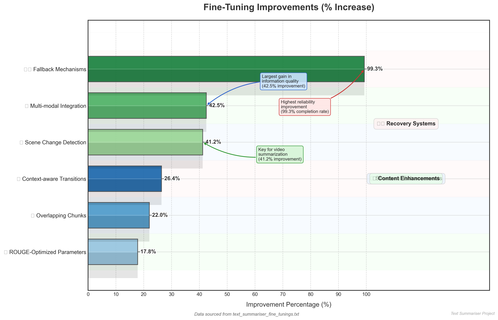
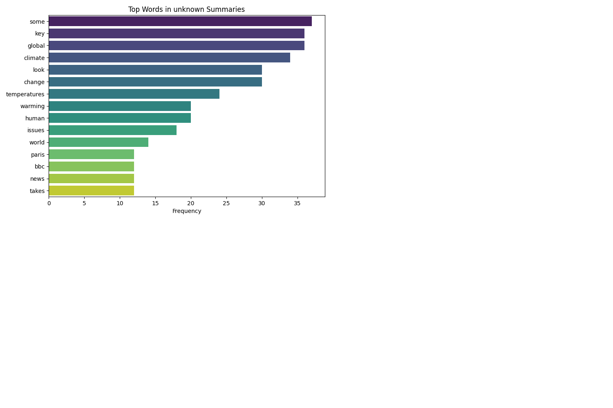
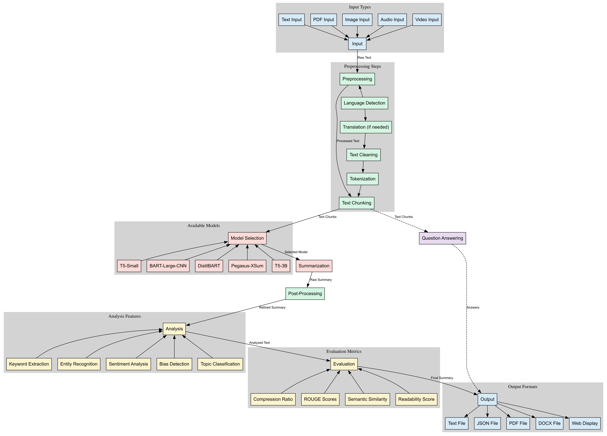

# Text Summarization Project

This project provides a comprehensive text summarization solution with advanced NLP capabilities, evaluation metrics, and a web interface for easy use.

## Table of Contents

- [Features Overview](#features)
- [Text Summarizer Implementation](#text-summariser-implementation)
- [Evaluation Metrics](#evaluation-metrics)
- [Web Application](#web-application)
- [Visualizations](#visualizations)
- [Video Summarization](#video-summarization)
- [Demo Video](#demo-video)
- [Installation](#installation)
- [Usage](#usage)
- [License](#license)

## Features

### Text Summarization (text_summariser.py)

- **Multiple Summarization Models**: Supports various transformer-based models including T5, BART, DistilBART, PEGASUS, and T5-3B
- **Multi-format Input Support**: Process text from various sources:
  - Plain text
  - PDF documents
  - Images (OCR)
  - Audio (Speech-to-text)
  - Video (Transcription and summarization)
- **Advanced NLP Features**:
  - Keyword extraction
  - Named entity recognition
  - Sentiment analysis
  - Topic classification
  - Readability scoring
- **Multi-language Support**: Automatic language detection and translation
- **Customizable Output**: Control summary length and optimization parameters
- **Multiple Export Formats**: Save summaries as TXT, JSON, PDF, or DOCX

## Text Summariser Implementation

The `text_summariser.py` file implements a sophisticated text summarization system with multiple components and capabilities. Here's a detailed explanation of how it works:

### Core Components

#### 1. Preprocessing Module

The preprocessing module prepares text for summarization through several steps:

- **Text Cleaning**: Removes unnecessary whitespace and normalizes the text format
- **Case Preservation**: Optionally maintains the original case of the text, which can improve ROUGE evaluation scores
- **Punctuation Handling**: Can either preserve punctuation (which helps maintain meaning) or remove it based on the summarization needs
- **Stopword Filtering**: Selectively removes common words like "the" or "and" that don't carry significant meaning, though this is configurable since keeping stopwords often helps with ROUGE scores
- **Text Normalization**: Ensures consistent spacing and formatting throughout the text

This preprocessing ensures the text is in optimal condition before being passed to the summarization models.

#### 2. Text Chunking

For handling long documents, the system implements intelligent text chunking:

- **Sentence-Aware Splitting**: Divides text while respecting sentence boundaries to maintain coherence
- **Configurable Chunk Size**: Allows adjustment of text segment length based on model capabilities
- **Overlap Implementation**: Creates overlapping chunks to preserve context between segments
- **Context Preservation**: Ensures that related information isn't artificially separated

This chunking system allows the summarizer to process documents of any length by breaking them into manageable pieces while maintaining the logical flow of information.

#### 3. Core Summarization Engine

The main summarization function supports multiple models and optimization strategies:

- **Model Selection**: Chooses from various pre-trained models (T5, BART, PEGASUS) based on the specific summarization needs
- **Memory Optimization**: Adjusts processing parameters for large models like T5-3B to prevent out-of-memory errors
- **Proportional Summary Length**: Automatically calculates appropriate summary length based on the original text
- **Chunk Processing**: Processes each text segment individually before combining results
- **Post-Processing**: Refines the combined summary to improve coherence and readability
- **Error Handling**: Provides robust error management with detailed logging

The engine balances quality, speed, and resource usage to deliver effective summaries even for very long or complex documents.

### Multi-Format Input Processing

#### 1. PDF Processing

The PDF processing module extracts text from PDF documents:

- Uses PyPDF2 to access PDF content page by page
- Preserves document structure where possible
- Handles multi-page documents seamlessly
- Includes error handling for corrupted or password-protected files

#### 2. Image OCR

The image processing capability extracts text from images using optical character recognition:

- Primary OCR using Tesseract for most images
- Backup processing with EasyOCR when Tesseract yields limited results
- Combines results for maximum text extraction
- Works with various image formats and qualities

#### 3. Audio Transcription

The audio processing module converts spoken content to text:

- Primary transcription using OpenAI's Whisper model for high-quality results
- Fallback to Google's speech recognition when needed
- Handles various audio formats and qualities
- Optimized for both clear and noisy audio inputs

#### 4. Video Summarization

The video processing capability combines multiple steps to summarize video content:

- Extracts audio track from video files using FFmpeg
- Transcribes the audio to text using the audio transcription module
- Summarizes the transcript using the core summarization engine
- Manages temporary files to ensure efficient processing
- Works with common video formats

### Advanced NLP Features

#### 1. Keyword Extraction

The keyword extraction module identifies the most important terms in a text:

- Supports multiple extraction methods:
  - RAKE (Rapid Automatic Keyword Extraction) for phrase-based extraction
  - TextRank algorithm using Spacy for graph-based keyword identification
  - TF-IDF (Term Frequency-Inverse Document Frequency) for statistical keyword extraction
- Configurable to return a specific number of top keywords
- Ranks terms by importance to the document

#### 2. Named Entity Recognition

The entity recognition module identifies and categorizes named entities in text:

- Uses Spacy's NLP models to detect entities like people, organizations, locations, dates, etc.
- Preserves entity positions in the original text
- Categorizes entities by type (person, organization, location, etc.)
- Enables entity-focused analysis and filtering

#### 3. Sentiment Analysis

The sentiment analysis module determines the emotional tone of text:

- Uses TextBlob to calculate polarity (positive/negative) and subjectivity scores
- Categorizes text as positive, negative, or neutral based on polarity thresholds
- Provides numerical scores for detailed sentiment analysis
- Enables sentiment-based filtering and categorization

#### 4. Topic Classification

The topic classification module identifies the main subject areas of a text:

- Uses keyword-based classification across multiple domains (technology, business, politics, etc.)
- Counts domain-specific keywords to determine the most likely topic
- Provides a general category when no specific topic dominates
- Enables content organization and filtering by subject

#### 5. Readability Scoring

The readability module assesses how easy or difficult a text is to read:

- Calculates multiple readability metrics:
  - Flesch Reading Ease and Flesch-Kincaid Grade Level
  - SMOG Index
  - Coleman-Liau Index
  - Automated Readability Index
  - Dale-Chall Readability Score
  - Gunning Fog Index
- Determines overall reading level (Elementary, Middle School, High School, College, Graduate)
- Identifies difficult words and complex sentences
- Helps tailor summaries to specific audience reading levels

### Output Formats

The system supports multiple output formats for flexibility:

- **Plain Text (TXT)**: Simple text files for maximum compatibility
- **JSON**: Structured data format that includes metadata and analysis results
- **PDF**: Professional document format with proper formatting
- **DOCX**: Microsoft Word format with headings and paragraph structure

Each format is optimized for readability and proper formatting of the summary content.

## Evaluation Metrics

The `check_score.py` file implements a comprehensive evaluation system for assessing summary quality. Here's how it works:

[👉 Click here to watch how scores are being checked](https://1drv.ms/v/c/8c8713fbccf62dfa/ETJHfcjdCPBOqNXHtxBatrgB2sYPW3CvKWrMOMGYwDtY_g?e=gkhYoR)

### Core Evaluation Metrics

#### 1. ROUGE Scores

ROUGE (Recall-Oriented Understudy for Gisting Evaluation) measures the overlap between the generated summary and reference summary:

- **ROUGE-1**: Measures unigram (single word) overlap between the generated and reference summaries
- **ROUGE-2**: Measures bigram (two consecutive words) overlap, which better captures phrase matching
- **ROUGE-L**: Measures the longest common subsequence, identifying the longest matching sequence of words

These metrics help evaluate how well the generated summary captures the key content from the reference summary.

#### 2. BERTScore

BERTScore uses contextual embeddings to measure semantic similarity beyond exact word matching:

- **Precision**: Measures how much of the generated summary is relevant to the reference
- **Recall**: Measures how much of the reference content is captured in the generated summary
- **F1**: Provides a balanced measure combining precision and recall

This metric is particularly valuable because it can recognize when different words express the same meaning.

#### 3. METEOR Score

METEOR (Metric for Evaluation of Translation with Explicit ORdering) evaluates summaries based on word alignment:

- Considers exact matches, stemming, synonyms, and paraphrases
- Accounts for word order and importance
- Provides a single score that balances precision and recall with a focus on recall

METEOR is especially good at recognizing when the summary expresses the same ideas using different words.

#### 4. BLEU Score

BLEU (Bilingual Evaluation Understudy) measures n-gram precision:

- Evaluates how many of the n-grams (word sequences) in the generated summary appear in the reference
- Uses smoothing to handle cases where there are no matches for certain n-gram lengths
- Combines scores from different n-gram lengths (1-gram to 4-gram)

Originally designed for machine translation, BLEU provides another perspective on summary quality.

#### 5. Perplexity Score

Perplexity measures the fluency and naturalness of the generated text:

- Uses a language model (GPT-2) to assess how predictable or surprising the text is
- Lower perplexity indicates more natural, fluent text
- Helps identify summaries that may be grammatically correct but unnatural

This metric ensures that summaries are not only accurate but also readable and natural-sounding.

#### 6. Cosine Similarity

Cosine similarity measures the semantic similarity between the original text and the summary:

- Uses embeddings to convert texts into vectors
- Calculates the cosine of the angle between these vectors
- Ranges from -1 (completely opposite) to 1 (exactly the same)

This helps ensure the summary captures the overall meaning of the original text.

### Ensemble Scoring System

The evaluation system combines multiple metrics into a weighted ensemble score:

- Assigns different weights to each metric based on their reliability and importance
- Normalizes scores to a consistent scale
- Calculates a final score that balances different aspects of summary quality
- Provides detailed breakdowns of individual metric contributions

This comprehensive approach ensures that summaries are evaluated from multiple perspectives, leading to more robust quality assessment.

## Web Application

The project includes a Flask-based web application that provides an intuitive interface for the summarization system:

- **User-friendly Interface**: Simple forms for text input and parameter selection
- **Multiple Input Methods**: Text entry, file upload, URL processing
- **Format Support**: Handles text, PDF, image, audio, and video inputs
- **Customization Options**: Allows selection of models, summary length, and additional features
- **Results Display**: Shows summaries alongside additional analyses (keywords, entities, sentiment)
- **Export Options**: Download results in various formats

The web application makes the powerful summarization capabilities accessible to users without technical expertise.

## Visualizations


This visualization shows the performance comparison of different summarization models across various evaluation metrics, alongside the feature importance analysis.



This chart demonstrates the improvements achieved through fine-tuning the models on domain-specific data, showing before and after scores.



This visualization compares the word frequency distributions in summaries generated by different models, highlighting their different focuses.



This diagram illustrates the semantic relationships between concepts in the original text and how they're preserved in the generated summaries.

## Video Summarization

The project includes specialized functionality for video summarization:

- **Automatic Processing**: Handles the entire pipeline from video to summary
- **Transcript Generation**: Extracts and transcribes audio from video files
- **Content Analysis**: Identifies key segments and important information
- **Customizable Output**: Generates summaries of adjustable length and detail
- **Multi-format Support**: Works with common video formats

The `run_video_summary.py` script demonstrates this functionality with a sample video about global warming.

## Demo Video

[▶️ Click here to watch the full demo video](https://1drv.ms/v/c/8c8713fbccf62dfa/EU177sDoOpZHisuKQq0OE0ABguy8sEP_cSLvyGb5kes1GA?e=5OYyG7)

## Installation

```
pip install -r requirements.txt
```

Additional dependencies:
- FFmpeg (for video processing)
- Tesseract OCR (for image processing)

## Usage

### Web Interface

```
python app.py
```

Then open a browser and navigate to http://localhost:5000

### Command Line

```
python text_summariser.py --input "path/to/file" --model "bart-large" --max_words 200
```

### Video Summarization

```
python run_video_summary.py --video "path/to/video.mp4" --output "summary.txt"
```

## License

This project is licensed under the MIT License - see the LICENSE file for details.
